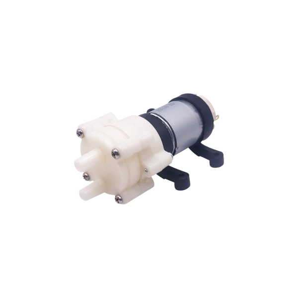
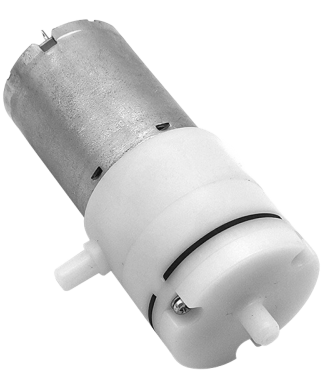

---
# the default layout is 'page'
icon: fas fa-droplet
order: 2
---

<!-- Nieuwe indeling -->

> Under construction
{: .prompt-warning }

## Introductie
Het watersysteem bestaat uit twee hoofdonderdelen:
- Watertoevoer en afvoer
- Stuurlogica

### Plan

## Toevoer
### Reservoirs:  
Het systeem bevat drie reservoirs:
- Waterreservoir
- Voedingsstofreservoir
- Mengreservoir

Dit zijn de bloembakken van vorig project. Deze waren ruim genoeg en konden eenvoudig geïntegreerd worden binnen ons ontwerp. 

De drie reservoirs zijn uitneembaar, wat het reinigen en bijvullen eenvoudig maakt. Elk reservoir is uitgerust met een ultrasone sensor voor het nauwkeurig meten van het vloeistofniveau. Om algengroei te voorkomen, wordt het water in de reservoirs continu gecirculeerd met behulp van luchtpompen en luchtstenen.
Meer informatie over de gebruikte componenten vindt u terug bij Stuurlogica. <!-- Nog even nakijken of het dit wel is.-->

Het mengreservoir ontvangt zowel water als voedingsstoffen en dient als mengpunt. Een aquariumpomp zorgt hier voor het mengen en circuleren van de vloeistof. Daarnaast is het mengreservoir voorzien van een UVC-lamp, als extra maatregel tegen micro-organismen en biologische verontreiniging.

### Pompsysteem: 
1. Twee pompen brengen water en voedingsstoffen vanuit hun respectievelijke reservoirs naar het mengreservoir.
2. Vanuit het mengreservoir transporteert een aparte pomp de gemengde vloeistof naar de lades. Omdat we gekozen hebben om met twee lades te werken, gebruiken we twee pompen voor de toevoer. Aan elke pomp kunnen  darmpjes op verschillende hoogtes worden aangesloten, waardoor we een modulair systeem hebben gecreëerd dat eenvoudig uitbreidbaar en aanpasbaar is. <!-- foto om te verduidelijken-->

### Lades
Het systeem is ontworpen om twee methodes van irrigatie te ondersteunen: 
- **Drip hydroponics (drip-systeem):** Bij deze techniek wordt een voedingsoplossing langzaam en gecontroleerd druppelsgewijs over de wortels van de planten gedruppeld. Dit zorgt ervoor dat de planten altijd toegang hebben tot voldoende water en voedingsstoffen, zonder dat het wortelgedeelte constant in water staat.
- **NFT (Nutrient Film Technique):** In dit systeem stroomt een dunne laag van de voedingsoplossing continu over de wortels van de planten, die zich bevinden in een schuin geplaatste goot. Dit zorgt voor een efficiënte opname van water en voedingsstoffen door de wortels.
- **Flood & Drain (ebb & flow):** De groeibak wordt periodiek tijdelijk overstroomd met de voedingsoplossing, waarna deze weer terugloopt naar het reservoir. Tijdens de "flood"-fase worden de wortels volledig ondergedompeld, en tijdens de "drain"-fase krijgen ze zuurstof. Dit afwisselend patroon stimuleert wortelgezondheid en efficiënte opname van nutriënten.

Dit laat toe om beide technieken te testen en onderling te vergelijken.

## Afvoer
### Zwaartekrachtgestuurd
De afvoer van water gebeurt op basis van zwaartekracht. De lade is voorzien van een valse bodem en staat licht gekanteld, zodat overtollig water via een pvc-buis terugstroomt naar het mengreservoir. Hierdoor is er geen extra pomp nodig voor de afvoer. De pvc-buis is deels open gesneden en voorzien van afdekkingen om spatten op te vangen. Op deze manier behouden we een hoge mate van modulariteit in het systeem.

### Hergebruik van water
<!--Nog aanpassen na bespreking-->
Het afgevoerde water wordt niet zomaar geloosd. In het mengreservoir wordt dit restwater opnieuw gefilterd en gesteriliseerd (door de UVC-lamp en eventueel een fijnmazig gaasfilter). Nadien kan dit water opnieuw gebruikt worden, eventueel met bijmenging van vers water of extra voedingsstoffen indien nodig.

Dit maakt het systeem duurzaam en circulair, met minimale water- en nutriëntenverspilling.

## Stuurlogica
### Pompaansturing
<!-- Ultrasoon, probes, pompen -->
### UVC

## Componenten en keuzes
### Reservoires

- **Functie**: Opslag van zuiver water, voedingsstoffen, en restwater
- **Voordelen:**  Budgetvriendelijk, goede integratie, makkelijk te reinigen 
- **Nadeel:** Niet afsluitbaar.

### Tubes
### afsluitingen 
### tussen stukken 
### Waterpomp

De [waterpomp](https://www.tinytronics.nl/nl/mechanica-en-actuatoren/motoren/pompen/waterpomp-12v){:target="_blank"} heeft een maximale spanning van 12VDC en gebruikt ~400mA (=> P=4,8W). De pomp heeft een maximale opvoerhoogte van 3m en aanzuighoogte van 1,5m. Deze is geschikt voor slangen met ongeveer 6mm binnendiameter.

### luchtpomp 
### Mixer

Voor het water- en voedingsstofreservoir werd een luchtpomp met luchtsteen gekozen voor de circulatie van het water. Dit wordt gedaan om de groei van algen te voorkomen.

Voor het mengreservoir werd een aquariumpomp gekozen. Dit zorgt voor een sterkere en turbulentere stroom van vloeistof die het water mengt. Deze pomp sturen we aan op basis van de hoogte in het reservoir (om te voorkomen dat de pomp lucht pompt, wat slecht is voor vloeistofpompen)

### UVC
### relais
### Probes
Elke plant heeft dezelfde voedingsstoffen nodig, deze voedingsstoffen zijn opgedeeld in verschillende klassen en zijn gekoppeld aan verschillende concentraties. De primaire voedingsstoffen zijn: Stikstof (N), Fosfor (P) en Kalium (K). Secundaire voedingsstoffen zijn Calcium (Ca), Magnesium (Mg) en Zwavel (S). En hiernaast zijn er ook nog vele micronutriënten.

Om de waterkwaliteit in de gaten te houden maken we gebruik van probes (elektroden). We kunnen echter niet voor elk van deze voedingsstoffen een elektrode voorzien, daarom beperken we ons tot een deelset. We kozen voor het gebruik van:

* [Nitraat probe](https://www.alibaba.com/product-detail/Nitrate-Ion-selective-Electrode-NO3-ISE_60817798149.html?spm=a2756.order-detail-ta-ta-b.0.0.58caf19cjuoxNt){:target="_blank"}
* [Kalium probe](https://www.alibaba.com/product-detail/ISE-K-Potassium-Ion-Selective-Electrode_1600225607843.html?spm=a2756.order-detail-ta-ta-b.0.0.58caf19cLXQOM1){:target="_blank"}
* [Calcium probe](https://www.alibaba.com/product-detail/PCa-1-01-Calcium-Ion-Selective_60659669573.html?spm=a2756.order-detail-ta-ta-b.0.0.58caf19cLXQOM1){:target="_blank"}

De reden waarom we het Calciumgehalte opmeten en niet het Fosforgehalte is omdat een probe voor het meten van fosfaten veel duurder is in vergelijking met de andere probes. <!-- er staat ook geen p waarde op ons fles, maar dat is nu louter toeval en maakt P niet onbelangrijk --> De Calcium probe is geïntegreerd omdat we stevige planten willen kweken in ons vertical farm. <!-- ... --> Daarnaast verwerkten we nog twee andere probes:

* [PH probe](https://nl.aliexpress.com/item/1005006063176996.html?spm=a2g0o.productlist.main.115.307031c2JATBrr&algo_pvid=62d5342a-588c-4537-a674-e9afbfd1070f&algo_exp_id=62d5342a-588c-4537-a674-e9afbfd1070f-57&pdp_ext_f=%7B%22order%22%3A%22313%22%2C%22eval%22%3A%221%22%7D&pdp_npi=4%40dis!EUR!6.03!4.82!!!6.34!5.07!%40210385a817430803088781346eafba!12000035561276406!sea!BE!0!ABX&curPageLogUid=X6BxvMVVvpLV&utparam-url=scene%3Asearch%7Cquery_from%3A){:target="_blank"}
* [Referentie probe](https://www.alibaba.com/product-detail/232-01-Reference-Electrode-Glass-Shell_60668853882.html?spm=a2756.order-detail-ta-ta-b.0.0.58caf19cLXQOM1){:target="_blank"}

De referentie probe is essentieeel voor het uitlezen van de overige probes. De ph-sensor is geintegreerd omdat verschillende planten houden van een verschillende bodem zuurtegraad. Er is beslist om geen temperatuurprobe te integreeren, we werken namelijk met een installatie binnenshuis, we veronderstellend dat de temperatuur relatief constant blijft. Daarnaast word de temperatuur in de kast gemeten, we zien dit als voldoende maatstaaf om de watertemperatuur te bepalen.

Dit maakt dat in totaal 5 probes zijn geïntegreerd. Deze probes worden gecallibreerd voor ze gebruikt kunnen worden, daarvoor zijn nog enkele componenten nodig, deze zullen we hieronder bespreken. De probes worden uitgelezen aan de hand van ADC-convertoren. <!-- , deze zijn gerecycled uit het vorige project.--> <!-- Dit klopt dan niet, gebeurd dit op print, de gerecycleerde ADC is voor vermogenmeting -->

<!--
#### Kallibratie
Deze probes moeten gecallibreerd worden voor het correct uitmeten van de voedingsstoffen in het mengreservoir.
-->

**Stockoplossingen**

We maken een aantal stockoplossingen, deze stockoplossingen zijn versterkte concentraties van zoutoplossingen voor het kalibreren van de elektroden, we zullen deze stockoplossingen volgens de juiste verhouding verdunnen. De stockoplossingen bevatten elk een aantal gewenste ionen, deze ionen worden gemeten door de elektroden waardoor we met deze bekende concentraties de elektroden juist kunnen afstemmen voor latere metingen.

_Gewenste stockoplossingen_

| Ion              | Kalibratie zout | Gewenste zout concentratie | Gewenste Ionen concentratie stockoplossing | Totaal volume van de oplossing | Absolute hoeveelheid zout |
| ---------------- | --------------- | -------------------------- | ------------------------------------------ | ------------------------------ | ------------------------- |
|                  |                 | [g/l]                      | [g/l]                                      | [ml]                           | [g]                       |
| NO3\- | NaNO3           | 21,9300                    | 16                                         | 100                            | 2,1930                    |
| Ca2+  | Ca(NO3)24H2O    | 11,7845                    | 2                                          | 100                            | 1,1785                    |
| K+    | KOH             | 2,8699                     | 2                                          | 200                            | 0,5740                    |

Omdat deze hoeveelheden in de praktijk te nauwkeurig zijn om exact af te meten, berekenen we de werkelijke ionenconcentratie na bereiding. De keuze van de stockoplossingen is gebeurd op basis van de beschikbaarheid van de aanwezige zouten en praktische overwegingen ten opzichte van de bereiding van de stockoplossingen. We maakten van elke stockoplossing 100 – 200 ml. Dit is een goede hoeveelheid voor een voldoende nauwkeurigheid en geeft ons voldoende stockoplossing voor alle kallibratievloeistoffen.

_Eigenlijke stockoplossingen_

| Ion              | Kalibratie zout | MM      | Totaal volume van de oplossing | Absolute hoeveelheid zout | Zout concentratie | Ionen concentratie stockoplossing |
| ---------------- | --------------- | ------- | ------------------------------ | ------------------------- | ----------------- | --------------------------------- |
|                  |                 | [g/mol] | [ml]                           | [g]                       | [g/l]             | [g/l]                             |
| NO3\- | NaNO3           | 84,9947 | 100                            | 2,1900                    | 21,900            | 15,9800                           |
| Ca2+  | Ca(NO3)24H2O    | 40,0780 | 100                            | 1,1786                    | 11,786            | 2,0000                            |
| K+    | KOH             | 56,1100 | 200                            | 0,5829                    | 2,9145            | 2,0300                            |

**Kalibratievloeistoffen**

Voor het kalibreren van de elektroden maken we gebruik van een driepuntsmeting, hiervoor maken we drie verschillende concentraties van de stockoplossing; een lage, medium en hoge concentratie. We meten vervolgens voor deze drie concentraties de probes (=elektroden) uit, waarna we een lineaire benadering kunnen trekken door deze drie punten. Op deze rechte kunnen we vervolgens met goede precisie onze probes kalibreren. Dit is nauwkeuriger dan een kallibratie met 1 meetpunt.

|                  | Low    | Medium | High   |
| ---------------- | ------ | ------ | ------ |
|                  | [mg/l] | [mg/l] | [mg/l] |
| NO3\- | 800    | 1200   | 1600   |
| Ca2+  | 100    | 200    | 400    |
| K+    | 100    | 200    | 400    |

**Referentie vloeistof**

De elektroden hebben ook een referentie nodig, hiervoor wordt een referentie probe gevuld met een bekende vloeistof. Dit is 3M KCl gesatureerd met AgCl. Deze oplossing kunnen  we echter aankopen en hoeven we niet zelf te maken.

**Voedingsstoffen** <!-- hier of op verwijzing hieronder? Vet of titel? #### Voedingsstof  -->

We hebben ervoor gekozen om geen eigen voedingsstoffen samen te stellen voor het voeden van de planten, in de plaats daarvan kozen we voor een commerciële oplossing. We hebben hiervoor plantenvoeding gekocht. Deze plantenvoeding heef een NK waarde van  2.5-4. Deze waarde verwijst naar de verhouding van stikstof en kalium in de voedingsstof. In ons geval bevat de voeding 2.5% Stikstof, dit bevordert de bladgroei en algemene groei van de plant en 4% Kalium, dit versterkt de weerstand van de plant, bevordert de wortelontwikkeling en de bloei/vruchtvorming. Er staat geen fosfor vermeld, dit wil zeggen dat de gekozen plantenvoeding weinig tot geen fosfor bevat. Voor een betere opbrengst van de kast is het dus een goeie optie in een later stadium te kijken voor hogere kwaliteit voedingsstoffen. In de gebruikershandleiding staan ook aanbevolen verhoudingen voor verschillende soorten planten namelijk: kruiden ¼ dop per 2l, groenten 1 dop per 5l. Dit is een interessante verhouding om mee te nemen voor de  tuning van de vertical farm en de mogelijke verschillende gewassen.

**Kallibratie**

Zodra de drie concentraties voor een sensor zijn gemaakt, vindt de 3-puntskalibratie plaats. De referentie-ISE en de stofspecifieke ISE worden achtereenvolgens in elk van de drie stofspecifieke concentraties geplaatst en de spanning wordt gemeten. 

<!-- Kallibratie nog opnieuw doen en aanpassen-->

| Ion  |      | Oplossing | Gemeten spanning |
| ---- | ---- | --------- | ---------------- |
|      |      | [mg/l]    | [mV]             |
| NO₃⁻ | Low  | 799       | 27               |
| NO₃⁻ | Med  | 959       | 13               |
| NO₃⁻ | High | 1598      | 27               |
| Ca²⁺ | Low  | 100       | 32               |
| Ca²⁺ | Med  | 200       | 38               |
| Ca²⁺ | High | 400       | 44               |
| K⁺   | Low  | 102       | 83               |
| K⁺   | Med  | 203       | 93               |
| K⁺   | High | 406       | 102              |

<!-- De temperatuur is niet opgenomen, we gaan uit van kamertemperatuur. De medium concentratie nitraat is hier 960 mg/l in plaats van 1200 mg/l. -->

<!-- Toevoer en afvoer first draft, integreren met bestaand -->
<!-- Werken Charlotte en ik nu de site af en Kjell en Sander de code? Navragen... -->
### Connecties
### ....

<!-- Vanaf hier oude-->
----------------------------------------------------------------------------------------------------------------------------------
### Pompen en Pompsysteem:  
Er zijn 2 pompen aanwezig om het water en de voedingsstoffen naar het mengreservoir te brengen. Er is per lade een pomp voorzien om de gemengde vloeistof te transporteren naar de bijhorende lade.

# Componenten/onderdelen

### Reservoirs:  

De bloembakken van vorig project worden hergebruikt als reservoirs. Deze zijn ruim genoeg en kunnen makkelijk geïntegreerd worden in het ontwerp.

## Stuurlogica

### Waterpomp:  
  
De [waterpomp](https://www.tinytronics.nl/nl/mechanica-en-actuatoren/motoren/pompen/waterpomp-12v){:target="_blank"} heeft een maximale spanning van 12VDC en gebruikt ~400mA (=> P=4,8W). De pomp heeft een maximale opvoerhoogte van 3m en aanzuighoogte van 1,5m. Deze is geschikt voor slangen met ongeveer 6mm binnendiameter.

### Mixer:
  
Voor het water- en voedingsstofreservoir werd een luchtpomp met luchtsteen gekozen voor de circulatie van het water. Dit wordt gedaan om de groei van algen te voorkomen.

Voor het mengreservoir werd een aquariumpomp gekozen. Dit zorgt voor een sterkere en turbulentere stroom van vloeistof die het water mengt. Deze pomp sturen we aan op basis van de hoogte in het reservoir (om te voorkomen dat de pomp lucht pompt, wat slecht is voor vloeistofpompen)

<!-- Wrm twee titels reservoirs? + onder reservoirs kopje UV-C? -->

### UV-C:  

<!-- Aanvulling -->
### Probes:
Elke plant heeft dezelfde voedingsstoffen nodig, deze voedingsstoffen zijn opgedeeld in verschillende klassen en zijn gekoppeld aan verschillende concentraties. De primaire voedingsstoffen zijn: Stikstof (N), Fosfor (P) en Kalium (K). Secundaire voedingsstoffen zijn Calcium (Ca), Magnesium (Mg) en Zwavel (S). En hiernaast zijn er ook nog vele micronutriënten.

Om de waterkwaliteit in de gaten te houden maken we gebruik van probes (elektroden). We kunnen echter niet voor elk van deze voedingsstoffen een elektrode voorzien, daarom beperken we ons tot een deelset. We kozen voor het gebruik van:

* [Nitraat probe](https://www.alibaba.com/product-detail/Nitrate-Ion-selective-Electrode-NO3-ISE_60817798149.html?spm=a2756.order-detail-ta-ta-b.0.0.58caf19cjuoxNt){:target="_blank"}
* [Kalium probe](https://www.alibaba.com/product-detail/ISE-K-Potassium-Ion-Selective-Electrode_1600225607843.html?spm=a2756.order-detail-ta-ta-b.0.0.58caf19cLXQOM1){:target="_blank"}
* [Calcium probe](https://www.alibaba.com/product-detail/PCa-1-01-Calcium-Ion-Selective_60659669573.html?spm=a2756.order-detail-ta-ta-b.0.0.58caf19cLXQOM1){:target="_blank"}

De reden waarom we het Calciumgehalte opmeten en niet het Fosforgehalte is omdat een probe voor het meten van fosfaten veel duurder is in vergelijking met de andere probes. <!-- er staat ook geen p waarde op ons fles, maar dat is nu louter toeval en maakt P niet onbelangrijk --> De Calcium probe is geïntegreerd omdat we stevige planten willen kweken in ons vertical farm. <!-- ... --> Daarnaast verwerkten we nog twee andere probes:

* [PH probe](https://nl.aliexpress.com/item/1005006063176996.html?spm=a2g0o.productlist.main.115.307031c2JATBrr&algo_pvid=62d5342a-588c-4537-a674-e9afbfd1070f&algo_exp_id=62d5342a-588c-4537-a674-e9afbfd1070f-57&pdp_ext_f=%7B%22order%22%3A%22313%22%2C%22eval%22%3A%221%22%7D&pdp_npi=4%40dis!EUR!6.03!4.82!!!6.34!5.07!%40210385a817430803088781346eafba!12000035561276406!sea!BE!0!ABX&curPageLogUid=X6BxvMVVvpLV&utparam-url=scene%3Asearch%7Cquery_from%3A){:target="_blank"}
* [Referentie probe](https://www.alibaba.com/product-detail/232-01-Reference-Electrode-Glass-Shell_60668853882.html?spm=a2756.order-detail-ta-ta-b.0.0.58caf19cLXQOM1){:target="_blank"}

De referentie probe is essentieeel voor het uitlezen van de overige probes. De ph-sensor is geintegreerd omdat verschillende planten houden van een verschillende bodem zuurtegraad. Er is beslist om geen temperatuurprobe te integreeren, we werken namelijk met een installatie binnenshuis, we veronderstellend dat de temperatuur relatief constant blijft. Daarnaast word de temperatuur in de kast gemeten, we zien dit als voldoende maatstaaf om de watertemperatuur te bepalen.

Dit maakt dat in totaal 5 probes zijn geïntegreerd. Deze probes worden gecallibreerd voor ze gebruikt kunnen worden, daarvoor zijn nog enkele componenten nodig, deze zullen we hieronder bespreken. De probes worden uitgelezen aan de hand van ADC-convertoren. <!-- , deze zijn gerecycled uit het vorige project.--> <!-- Dit klopt dan niet, gebeurd dit op print, de gerecycleerde ADC is voor vermogenmeting -->

<!--
#### Kallibratie
Deze probes moeten gecallibreerd worden voor het correct uitmeten van de voedingsstoffen in het mengreservoir.
-->

**Stockoplossingen**

We maken een aantal stockoplossingen, deze stockoplossingen zijn versterkte concentraties van zoutoplossingen voor het kalibreren van de elektroden, we zullen deze stockoplossingen volgens de juiste verhouding verdunnen. De stockoplossingen bevatten elk een aantal gewenste ionen, deze ionen worden gemeten door de elektroden waardoor we met deze bekende concentraties de elektroden juist kunnen afstemmen voor latere metingen.

_Gewenste stockoplossingen_

| Ion              | Kalibratie zout | Gewenste zout concentratie | Gewenste Ionen concentratie stockoplossing | Totaal volume van de oplossing | Absolute hoeveelheid zout |
| ---------------- | --------------- | -------------------------- | ------------------------------------------ | ------------------------------ | ------------------------- |
|                  |                 | [g/l]                      | [g/l]                                      | [ml]                           | [g]                       |
| NO3\- | NaNO3           | 21,9300                    | 16                                         | 100                            | 2,1930                    |
| Ca2+  | Ca(NO3)24H2O    | 11,7845                    | 2                                          | 100                            | 1,1785                    |
| K+    | KOH             | 2,8699                     | 2                                          | 200                            | 0,5740                    |

Omdat deze hoeveelheden in de praktijk te nauwkeurig zijn om exact af te meten, berekenen we de werkelijke ionenconcentratie na bereiding. De keuze van de stockoplossingen is gebeurd op basis van de beschikbaarheid van de aanwezige zouten en praktische overwegingen ten opzichte van de bereiding van de stockoplossingen. We maakten van elke stockoplossing 100 – 200 ml. Dit is een goede hoeveelheid voor een voldoende nauwkeurigheid en geeft ons voldoende stockoplossing voor alle kallibratievloeistoffen.

_Eigenlijke stockoplossingen_

| Ion              | Kalibratie zout | MM      | Totaal volume van de oplossing | Absolute hoeveelheid zout | Zout concentratie | Ionen concentratie stockoplossing |
| ---------------- | --------------- | ------- | ------------------------------ | ------------------------- | ----------------- | --------------------------------- |
|                  |                 | [g/mol] | [ml]                           | [g]                       | [g/l]             | [g/l]                             |
| NO3\- | NaNO3           | 84,9947 | 100                            | 2,1900                    | 21,900            | 15,9800                           |
| Ca2+  | Ca(NO3)24H2O    | 40,0780 | 100                            | 1,1786                    | 11,786            | 2,0000                            |
| K+    | KOH             | 56,1100 | 200                            | 0,5829                    | 2,9145            | 2,0300                            |

**Kalibratievloeistoffen**

Voor het kalibreren van de elektroden maken we gebruik van een driepuntsmeting, hiervoor maken we drie verschillende concentraties van de stockoplossing; een lage, medium en hoge concentratie. We meten vervolgens voor deze drie concentraties de probes (=elektroden) uit, waarna we een lineaire benadering kunnen trekken door deze drie punten. Op deze rechte kunnen we vervolgens met goede precisie onze probes kalibreren. Dit is nauwkeuriger dan een kallibratie met 1 meetpunt.

|                  | Low    | Medium | High   |
| ---------------- | ------ | ------ | ------ |
|                  | [mg/l] | [mg/l] | [mg/l] |
| NO3\- | 800    | 1200   | 1600   |
| Ca2+  | 100    | 200    | 400    |
| K+    | 100    | 200    | 400    |

**Referentie vloeistof**

De elektroden hebben ook een referentie nodig, hiervoor wordt een referentie probe gevuld met een bekende vloeistof. Dit is 3M KCl gesatureerd met AgCl. Deze oplossing kunnen  we echter aankopen en hoeven we niet zelf te maken.

**Voedingsstoffen** <!-- hier of op verwijzing hieronder? Vet of titel? #### Voedingsstof  -->

We hebben ervoor gekozen om geen eigen voedingsstoffen samen te stellen voor het voeden van de planten, in de plaats daarvan kozen we voor een commerciële oplossing. We hebben hiervoor plantenvoeding gekocht. Deze plantenvoeding heef een NK waarde van  2.5-4. Deze waarde verwijst naar de verhouding van stikstof en kalium in de voedingsstof. In ons geval bevat de voeding 2.5% Stikstof, dit bevordert de bladgroei en algemene groei van de plant en 4% Kalium, dit versterkt de weerstand van de plant, bevordert de wortelontwikkeling en de bloei/vruchtvorming. Er staat geen fosfor vermeld, dit wil zeggen dat de gekozen plantenvoeding weinig tot geen fosfor bevat. Voor een betere opbrengst van de kast is het dus een goeie optie in een later stadium te kijken voor hogere kwaliteit voedingsstoffen. In de gebruikershandleiding staan ook aanbevolen verhoudingen voor verschillende soorten planten namelijk: kruiden ¼ dop per 2l, groenten 1 dop per 5l. Dit is een interessante verhouding om mee te nemen voor de  tuning van de vertical farm en de mogelijke verschillende gewassen.

**Kallibratie**

Zodra de drie concentraties voor een sensor zijn gemaakt, vindt de 3-puntskalibratie plaats. De referentie-ISE en de stofspecifieke ISE worden achtereenvolgens in elk van de drie stofspecifieke concentraties geplaatst en de spanning wordt gemeten. 

<!-- Kallibratie nog opnieuw doen en aanpassen-->

| Ion  |      | Oplossing | Gemeten spanning |
| ---- | ---- | --------- | ---------------- |
|      |      | [mg/l]    | [mV]             |
| NO₃⁻ | Low  | 799       | 27               |
| NO₃⁻ | Med  | 959       | 13               |
| NO₃⁻ | High | 1598      | 27               |
| Ca²⁺ | Low  | 100       | 32               |
| Ca²⁺ | Med  | 200       | 38               |
| Ca²⁺ | High | 400       | 44               |
| K⁺   | Low  | 102       | 83               |
| K⁺   | Med  | 203       | 93               |
| K⁺   | High | 406       | 102              |

<!-- De temperatuur is niet opgenomen, we gaan uit van kamertemperatuur. De medium concentratie nitraat is hier 960 mg/l in plaats van 1200 mg/l. -->

<!-- Toevoer en afvoer first draft, integreren met bestaand -->
<!-- Werken Charlotte en ik nu de site af en Kjell en Sander de code? Navragen... -->
# Intro

Het deel water van de vertical farm omvat twee grote delen:
    - Irregatie en waterafvoer
    - Pompen en stuurlogica
In dit deel word dieper ingegaan op de hardware gefocust rond water toe- en afvoer, en het water zelf. De watertoevoer is nauw verbonden aan de pomplogica, voor de waterafvoer is gebruik gemaakt van zwaartekracht. Er zijn meerdere concepten doorlopen, uiteindelijk is gekozen voor een kastsysteem waarbij water afloopt naar een centraal reservoir, waar het restwater gefilterd <!-- UV-C + gaas? --> en hergebruikt kan worden. In dit mengvat kan ook schoon water en voedingsstoffen toegevoegd worden om een optimale waterconditie te creëren voor de planten. Voor de watertoevoer is geopteerd om met twee verschillende methodes te werken namelijk drip hydroponics/ NFT en een flood and drain. <!-- nakijken, volgens mij andere benamingen op toledo --> 
Op deze manier konden we de twee methoden vergelijken, het systeem is volledig modulair, dus naar de toekomst toe kan de tweede lade ook omgebouwd worden naar de best werkende methode.

<!-- 
    Persoonlijke nota 
    Mss voor verbeteringen naar de toekomst, is natuurlijk wel stuk complexer

Momenteel word gewerkt met een systeem waarin tegelijk twee lades gevoed kunnen worden, deze twee lades worden gevoed vanuit hetzelfde mengvat, verschillende planten kunnen echter voordeel halen uit verschillende concentraties voedingsstoffen, dit maakt het interresant om het mengvat eventueel op te splitsen in twee delen. Er is echter gekozen voor een 1 vat systeem om een meting uit te kunnen voeren met de hoogtesensor, probes, UV-C ...
-->

<!-- nog iets? Komt van alles op, maar vergeet het soms ook, wat is de scope van de website? -->

## Componenten
### Algemeen    <!-- Mss voor uniformiteit ook settelen op een stijl, markdown of html -->
* [8 mm tubing](https://www.tinytronics.nl/nl/mechanica-en-actuatoren/onderdelen/slangen/waterslang-voor-onderwaterpomp-verticaal-horizontaal-3-6v-transparant-1-meter){:target="_blank"}
* [push-in fittings](https://nl.aliexpress.com/item/1005005808872752.html?spm=a2g0o.productlist.main.7.3edaJcT6JcT6q5&algo_pvid=3a7059ff-e7ee-43a2-b5fc-a499e4ff6cb3&algo_exp_id=3a7059ff-e7ee-43a2-b5fc-a499e4ff6cb3-3&pdp_ext_f=%7B%22order%22%3A%22400%22%2C%22eval%22%3A%221%22%7D&pdp_npi=4%40dis%21EUR%212.75%210.97%21%21%212.81%210.99%21%402103864c17398869650571235ecd39%2112000034430185033%21sea%21BE%210%21ABX&curPageLogUid=4qEj3wATijZm&utparam-url=scene%3Asearch%7Cquery_from%3A){:target="_blank"}
* [push-in caps](#){:target="_blank"}
* [Regenpijp](https://www.gamma.be/nl/assortiment/martens-buis-sanitair-glad-grijs-3-m-x-90-mm-x-1-8-mm/p/B463443?base_click=true){:target="_blank"}

* [Eindloopschakelaars](#){:target="_blank"}

<!--
    Bakken nakijken met team plantenbak
    Hoeveel details hier (main componenten?)
-->
### Systeem 1
Ventiel
### Systeem 2
8mm Druppelirrigatie 

## Voedingsstoffen
<!-- Waar moet dit komen te staan, kan hier uitleggen maar gaat beter staan bij probes, staan nog niet uitgelegd in bovenstaande stuk.-->

<!-- 
    Hoe doet iedereen die algemene dingen, verwerkt iedereen zijn stukje, komt daar nog een tab voor, ...?
    Idem met energie etc... 
-->
## Dashboard?

<!-- hulpstukken al aanwezig of ge 3D print ... -->
