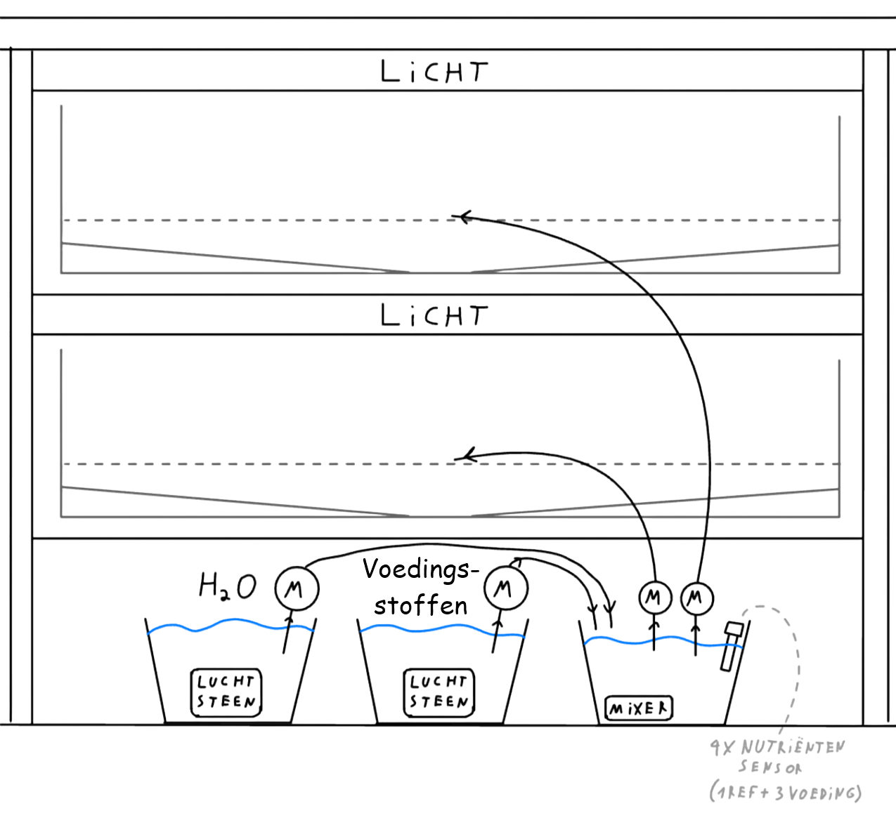

---
# the default layout is 'page'
icon: fas fa-droplet
order: 2
---

<!-- > Add Markdown syntax content to file `_tabs/about.md`{: .filepath } and it will show up on this page.
 {: .prompt-tip } -->

> Under construction
{: .prompt-warning }

## Plan

Het systeem bestaat uit onderstaande componenten, aan elkaar gekoppeld:

- **Reservoirs**:  
Het systeem bevat 1 waterreservoir, 1 voedingsstofreservoir en 1 mengreservoir. Het gerecycleerde water (=water dat terug uit de plantenlades komt) wordt teruggebracht in het watersysteem.  
Het water- en voedingsstofreservoir kunnen aangevuld worden door een klep te openen aan de kast. Elk reservoir bevat een ultrasone sensor om de hoogte van de vloeistof op te meten.  
De luchtstenen (aangevoerd door luchtpompen) in het water- en voedingsstofreservoir circuleren de vloeistof om de groei van algen tegen te houden. In het mengreservoir wordt een aquariumpomp gebruikt om de vloeistoffen te mengen en ook de groei van algen tegen te gaan. In het mengreservoir zit ook een UVC-lamp, als extra maatregel tegen contaminanten (micro-organismen en biologische stoffen).

- **Pompen en Pompsysteem**
Er zijn 2 pompen aanwezig om het water en de voedingsstoffen naar het mengreservoir te brengen. Er is per lade een pomp voorzien om de gemengde vloeistof te transporteren naar de bijhorende lade.