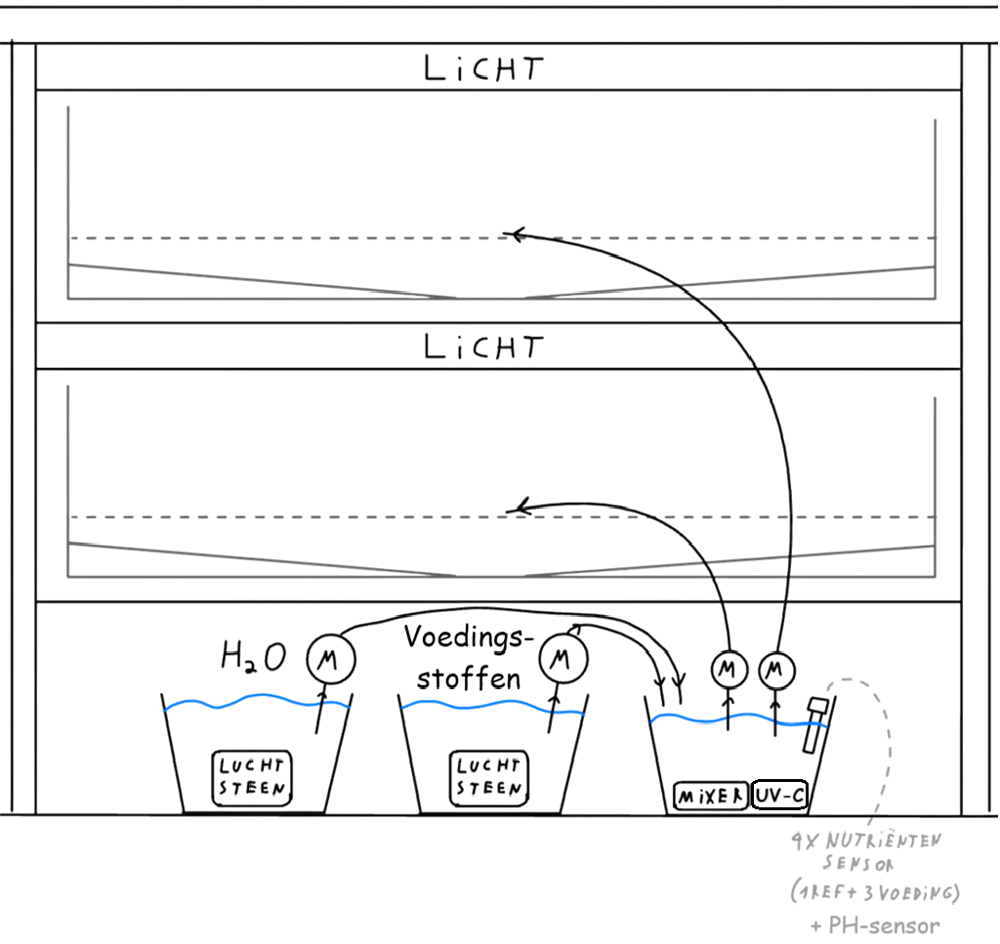

---
# the default layout is 'page'
icon: fas fa-droplet
order: 2
---

> Under construction
{: .prompt-warning }

## Plan

Het systeem bestaat uit onderstaande componenten, aan elkaar gekoppeld:

### Reservoirs:  
Het systeem bevat 1 waterreservoir, 1 voedingsstofreservoir en 1 mengreservoir. Het gerecycleerde water (=water dat terug uit de plantenlades komt) wordt teruggebracht in het watersysteem.  
Het water- en voedingsstofreservoir kunnen aangevuld worden door een klep te openen aan de kast. Elk reservoir bevat een ultrasone sensor om de hoogte van de vloeistof op te meten.  
De luchtstenen (aangevoerd door luchtpompen) in het water- en voedingsstofreservoir circuleren de vloeistof om de groei van algen tegen te houden. In het mengreservoir wordt een aquariumpomp gebruikt om de vloeistoffen te mengen en ook de groei van algen tegen te gaan. In het mengreservoir zit ook een UVC-lamp, als extra maatregel tegen contaminanten (micro-organismen en biologische stoffen).

### Pompen en Pompsysteem:  
Er zijn 2 pompen aanwezig om het water en de voedingsstoffen naar het mengreservoir te brengen. Er is per lade een pomp voorzien om de gemengde vloeistof te transporteren naar de bijhorende lade.

# Compontenten/onderdelen

### Reservoirs:  
  
De bloembakken van vorig project worden hergebruikt als reservoirs. Deze zijn ruim genoeg en kunnen makkelijk geïntegreerd worden in het ontwerp.

## Sensoren en Actuatoren

### Waterpomp:  
  
De [waterpomp](https://www.tinytronics.nl/nl/mechanica-en-actuatoren/motoren/pompen/waterpomp-12v){:target="_blank"} heeft een maximale spanning van 12VDC en gebruikt ~400mA (=> P=4,8W). De pomp heeft eenmaxiale opvoerhoogte van 3m en aanzuighoogte van 1,5m. Deze is geschikt voor slangen met ongeveer 6mm binnendiameter.

### Mixer:
  
Voor het water- en voedingsstofreservoir werd een luchtpomp met luchtsteen gekozen voor de circulatie van het water. Dit wordt gedaan om de groei van algen te voorkomen.

Voor het mengreservoir werd een aquariumpomp gekozen. Dit zorgt voor een sterkere en turbulentere stroom van vloeistof die het water mengt. Deze pomp sturen we aan op basis van de hoogte in het reservoir (om te voorkomen dat de pomp lucht pompt, wat slecht is voor vloeistofpompen)
